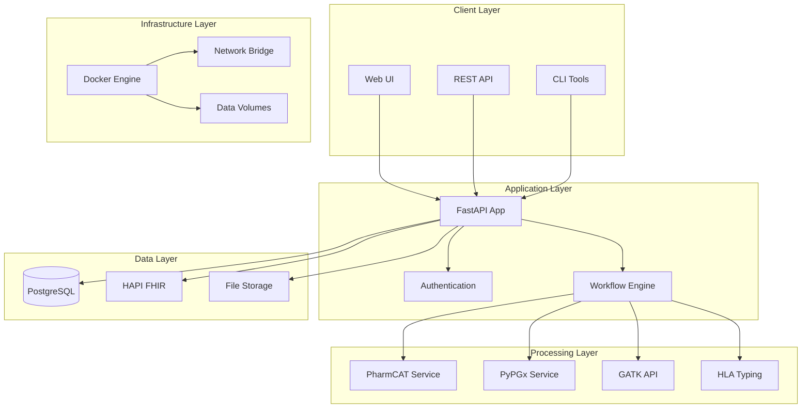
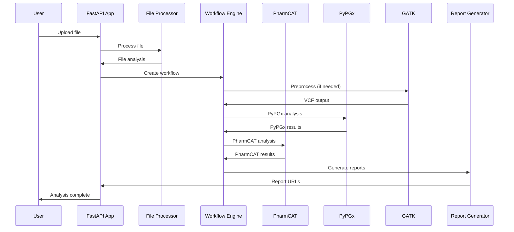
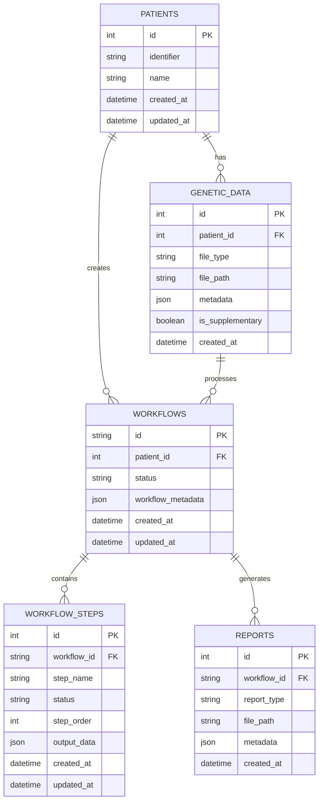

# System Architecture

Detailed technical architecture and design principles of ZaroPGx.

> **Quick Reference**: For a high-level overview of components and port mappings, see the [Architecture Overview](../architecture.md).

## High-Level Architecture

ZaroPGx is built as a microservices architecture using both reference and API wrapper Docker containers, orchestrated with Docker Compose. The system is designed for extensibility, maintainability, and ensures PHI data privacy when run locally "on premises".

### Core Components



## Service Architecture

### Core FastAPI Application (`app`)

**Purpose**: Main orchestrator and web user interface
**Technology**: Python 3.12, FastAPI, SQLAlchemy, psycopg, sam,bcftools
**Port**: 8765 → 8000

**Key Responsibilities:**
- Web UI and API endpoints
- Workflow orchestration
- Database management
- Report generation
- Authentication and authorization

**Key Modules:**
- `app/api/`: API routes and models
- `app/services/`: Background processing
- `app/reports/`: Report generation
- `app/pharmcat/`: PharmCAT integration
- `app/core/`: Core utilities

### PostgreSQL Database (`db`)

**Purpose**: Primary data storage
**Technology**: PostgreSQL 17 (latest stable revision of)
**Port**: 5444 → 5432

**Schemas:**
- `public`: Core application data
- `cpic`: CPIC guidelines and data
- `fhir`: FHIR r5 genomic IG resources
- `user_data`: User and patient data
- `reports`: Generated reports metadata
- `phenopackets`: In progress

**Key Tables:**
- `patients`: Patient information
- `genetic_data`: Genomic file metadata
- `workflows`: Analysis workflows
- `workflow_steps`: Individual processing steps
- `reports`: Generated report metadata

### PharmCAT Service (`pharmcat`)

**Purpose**: Pharmacogenomic analysis engine
**Technology**: Java 17, FastAPI wrapper
**Port**: 5001 → 5000

**Key Features:**
- Star allele calling for 23 core pharmacogenes
- CPIC, DWPG, FDA guidelines integration
- HTML Report generation
- Outside call integration for uncallable genes

**API Endpoints:**
- `POST /analyze`: Analyze VCF file
- `GET /status/{job_id}`: Check analysis status
- `GET /results/{job_id}`: Get analysis results

### PyPGx Service (`pypgx`)

**Purpose**: Comprehensive allele calling
**Technology**: Python, PyPGx affordances
**Port**: 5053 → 5000

**Key Features:**
- Star allele calling for 87 pharmacogenes
- Difficult to type genes such as CYP2D6
- Considers SVs and CNVs
- Diplotype and phenotype prediction

**Supported Genes:**
- see config/genes.json

### GATK API (`gatk-api`)

**Purpose**: Multiple functions
**Technology**: Java, GATK affordances
**Port**: 5002 → 5000

**Key Features:**
- BAM/SAM/CRAM to VCF conversion
- Variant calling and filtering
- Quality control metrics
- Reference genome processing

**Processing Pipeline:**
1. Input validation
2. Reference genome preparation
3. Variant calling
4. Quality filtering
5. VCF output generation

### ZaroHLA Typing Service (`zarohla`)

**Purpose**: HLA allele calling
**Technology**: Nextflow, OptiType
**Port**: 5055 → 5055

**Key Features:**
- HLA-A, HLA-B, HLA-C typing
- OptiType core

### HAPI FHIR Server (`fhir-server`)

**Purpose**: Healthcare data interoperability
**Technology**: Java, HAPI FHIR
**Port**: 8090 → 8080

**Key Features:**
- FHIR compliance
- Groundwork laid for enterprise expansion
- Observation resource storage
- Structured semantic FHIR query capability

## Data Flow Architecture

### Upload and Processing Flow



### Database Schema Design



## Container Architecture

### Docker Compose Structure

```yaml
see `docker-compose.yml.example`
```

### Network Architecture

**Bridge Network**: `pgx-network`
- **Subnet**: 172.28.0.0/16
- **Gateway**: 172.28.0.1
- **DNS**: 172.28.0.1

**Service Communication:**
- All services communicate via internal network
- External access only through exposed ports
- No direct internet access for processing services

### Volume Management

**Data Volumes:**
- `./data`: Shared data directory
- `./reference`: Reference genome data
- `postgres_data`: Database persistence
- `pharmcat_data`: PharmCAT reference data

**Volume Mounts:**
- Host directories mounted into containers
- Persistent data across container restarts
- Shared access between services

## Security Architecture

### Authentication and Authorization

**Development Mode:**
- Authentication disabled by default
- All endpoints publicly accessible
- Debug logging enabled

**Production Mode:**
- JWT-based authentication
- Role-based access control
- Secure session management
- Audit logging

### Data Privacy

**Local Processing:**
- All analysis happens locally
- No external data transmission
- Complete data control
- Offline capability

**Data Encryption:**
- Data at rest encryption (configurable)
- TLS for API communication
- Secure file storage
- Encrypted database connections

### Network Security

**Internal Communication:**
- Services communicate via internal network
- No external network access for processing
- Firewall rules for port access
- VPN support for remote access

## Scalability Architecture

### Horizontal Scaling

**Application Layer:**
- Multiple FastAPI instances
- Load balancer distribution
- Session affinity for workflows
- Shared database backend

**Processing Layer:**
- Multiple PharmCAT instances
- Queue-based job distribution
- Resource-aware scheduling
- Auto-scaling based on load

### Vertical Scaling

**Resource Allocation:**
- Configurable CPU/memory limits
- Dynamic resource adjustment
- Priority-based scheduling
- Resource monitoring

### Storage Scaling

**Database Scaling:**
- Read replicas for queries
- Connection pooling
- Query optimization
- Indexing strategies

**File Storage:**
- Distributed file systems
- Object storage integration
- Backup and replication
- Data lifecycle management

## Monitoring and Observability

### Logging Architecture

**Centralized Logging:**
- Structured JSON logs
- Log aggregation and analysis
- Error tracking and alerting
- Performance monitoring

**Log Levels:**
- DEBUG: Detailed debugging information
- INFO: General information
- WARNING: Warning messages
- ERROR: Error conditions
- CRITICAL: Critical errors

### Metrics and Monitoring

**Application Metrics:**
- Request/response times
- Error rates
- Throughput metrics
- Resource utilization

**System Metrics:**
- CPU and memory usage
- Disk I/O performance
- Network traffic
- Container health

### Health Checks

**Service Health:**
- HTTP health endpoints
- Database connectivity
- External service availability
- Resource availability

**Workflow Health:**
- Processing status
- Queue depth
- Error rates
- Performance metrics

## Development Architecture

### Code Organization

**Module Structure:**
```
app/
├── api/           # API routes and models
├── core/          # Core utilities
├── pharmcat/      # PharmCAT integration
├── reports/       # Report generation
├── services/      # Background services
├── utils/         # Utility functions
└── visualizations/ # Workflow diagrams
```

**Design Patterns:**
- Dependency injection
- Service layer pattern
- Repository pattern
- Factory pattern
- Observer pattern

### Testing Architecture

**Test Types:**
- TO DO

**Test Infrastructure:**
- TO DO

## Deployment Architecture

### Environment Management

**Development:**
- Local Docker Compose
- Debug logging enabled
- Hot reloading
- Test data included

**Staging:**
- Production-like environment
- Real data testing
- Performance validation
- Security testing

**Production:**
- Optimized configuration
- Security hardening
- Monitoring and alerting
- Backup and recovery

### CI/CD Pipeline

**Build Process:**
- Docker image building
- Dependency scanning
- Security scanning
- Image optimization


## Next Steps

- **API Reference**: {doc}`api-reference`
- **Development Setup**: {doc}`development-setup`
- **Contributing**: {doc}`contributing`
- **Deployment**: {doc}`deployment`
